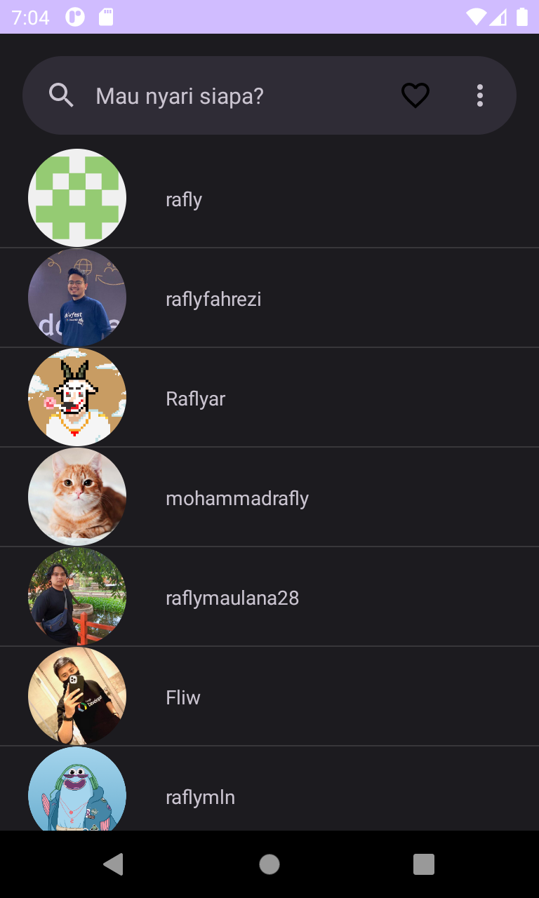
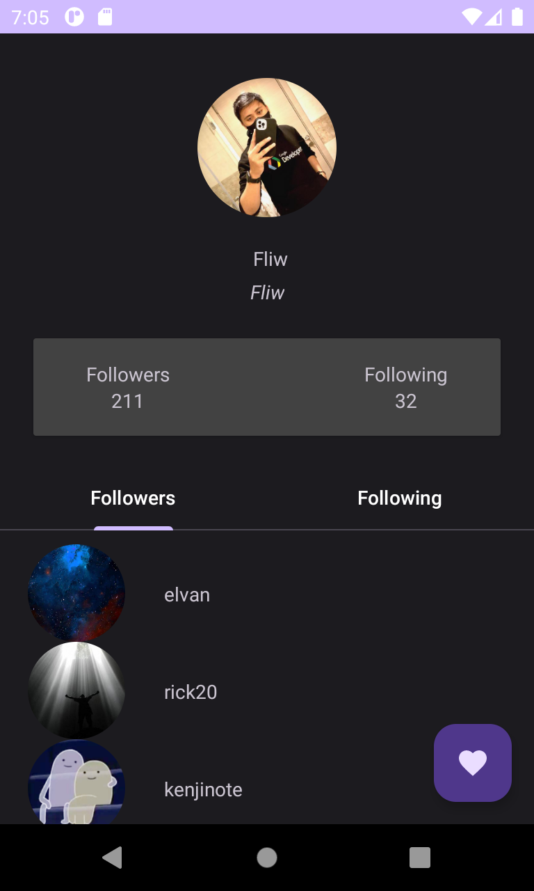
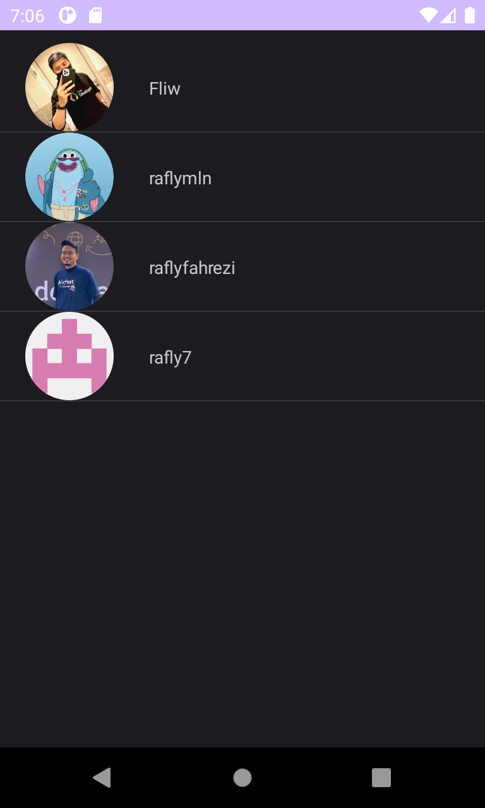
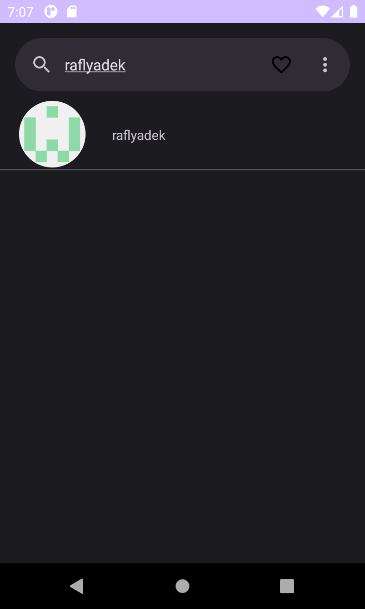
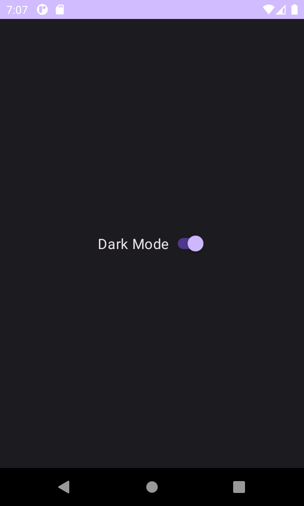

# Android MVVM Architecture - GithubUser

`MVVM Architecture` is one of the most popular architecture to develop an app. MVVM architectural pattern divides an application into three key components: Model, View, and ViewModel. Model: This is your business logic and data. Here, you process data, perform operations, and interact with data sources. View: This is the User Interface (UI). ViewModel: Acts as a mediator between the model and view.

## Prerequisites
Basic `Kotlin`, knowledge of `HTTP` request by Retrofit Library, and `Room` for `CRUD` database

## Project Description
I build a Github User Application with MVVM Architecture. In the home screen you will get list of github user profile, when you click the profile you will get the detail of the profile like followers and following and then on the bottom of the detail profile you will see the `Floating Action Button` that you can click to add the user to the favorite screen, this action using the `Database` that we create using `Room library` and `DAO` annotation to save the user to local database. Then there are Dark mode on setting which i use `DataStore` to save the value to local storage so when you close the app it will keep the dark mode setting.

## Github API
I use [Github API](https://api.github.com/) for collecting Github user information. You will get 60 requests per hour without have to sign up, but if you need more you can use `Token` on `Header` in your retrofit setting to get up to 5000 requests per hour.

## Libraries
* [Retrofit](https://github.com/square/retrofit) for HTTP Request
* [Glide](https://github.com/bumptech/glide) for Image Loader
* [Room](https://developer.android.com/jetpack/androidx/releases/room) for Local Database
* [DataStore](https://developer.android.com/jetpack/androidx/releases/datastore) for Local Data Storage
* [Ksp](https://github.com/google/ksp/releases) for Annotation Processors

## Run Project
This Project was build on `JDK 1.7`. Sync the `Gradle` and run the project. Install APK on your emulator or real device. Dont forget to turn on the `internet` of your device so the application can access the API
